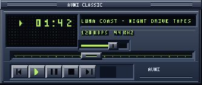
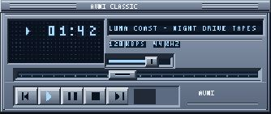
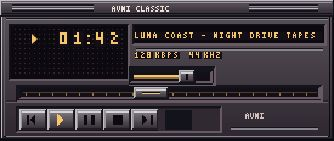

# Avni

Your YouTube Music, in a classic skin.

Avni is a macOS companion for YouTube Music with a classic skinnable player, original skins and local `.wsz` import. YouTube Music handles sign-in and audio playback.

**Avni 0.1.0 public beta** is available for Apple Silicon Macs running macOS 14 (Sonoma) or later. The DMG is Developer ID signed and Apple notarized. This repository contains release information and branding; the application source and Homebrew cask are not published yet.

[Visit the Avni website](https://ramazanayyildiz.github.io/avni-site/)

## Original skins

| Graphite LCD | Silver Blue | Amber Terminal |
| --- | --- | --- |
|  |  |  |

Three original built-in skins, with 1× and 2× player sizes. These are static artwork previews from the concept site, with fictional track information; they are not live playback screenshots. Avni also supports local import of compatible `.wsz` skins.

## Download and install

[**Download Avni 0.1.0 for Apple Silicon (.dmg)**](https://github.com/ramazanayyildiz/avni/releases/download/v0.1.0/Avni_0.1.0_aarch64.dmg) · [Release notes and checksums](https://github.com/ramazanayyildiz/avni/releases/tag/v0.1.0)

1. Download `Avni_<version>_aarch64.dmg` from the release's **Assets** section.
2. Open it and drag **Avni.app** into **Applications**.
3. Open Avni from Applications.
4. Choose **Sign in to YouTube Music**, or **Account → Open YouTube Music**, and sign in.

For an update, quit Avni before replacing it in Applications. The release assets include `SHA256SUMS.txt`, build provenance, the dependency inventory and full third-party license notices.

Playlist loading can still be slow; the loaded-song count reports progress. Minimum macOS 14 metadata and signing checks passed, but clean-install/upgrade and macOS 14 device acceptance remain open. This is an early beta, not a claim of completed device coverage. Compatible classic `.wsz` skins are supported; `.wal` skins and audio equalization are not.

## Follow development

[Follow @ayyi1diz on X](https://x.com/ayyi1diz) for project updates.

The approved identity combines an amber pixel A/play symbol, ivory wordmark and graphite app icon. Original assets were created for Avni with imagegen and are distributed here under the [MIT License](LICENSE). The selected application source license is also MIT; third-party software and assets retain their own licenses.

Avni is independent of Google and YouTube and is not affiliated with or endorsed by either. YouTube Music is a trademark of Google LLC. No historical third-party Winamp skin collection is bundled.
