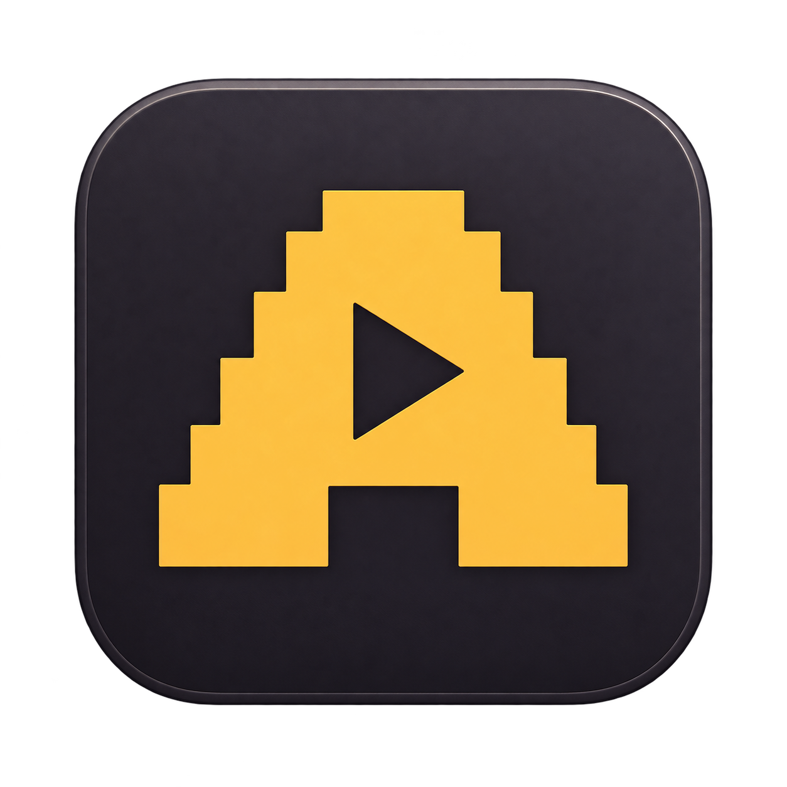

# Avni

Your YouTube Music, in a classic skin.

Avni is a macOS companion for YouTube Music with a classic skinnable player, original skins and local `.wsz` import. YouTube Music handles sign-in and audio playback.

**The public beta and application source are not available yet.** This repository currently contains the approved Avni branding and project landing information. A signed and notarized Apple Silicon candidate for macOS 14 (Sonoma) or later is undergoing install and release acceptance. There is no public installer or Homebrew cask yet.

[Visit the Avni website](https://ramazanayyildiz.github.io/avni-site/)

The approved identity combines an amber pixel A/play symbol, ivory wordmark and graphite app icon. Original assets were created for Avni with imagegen and are distributed here under the [MIT License](LICENSE). The selected application source license is also MIT; third-party software and assets retain their own licenses.

Avni is independent of Google and YouTube and is not affiliated with or endorsed by either. YouTube Music is a trademark of Google LLC. No historical third-party Winamp skin collection is bundled.
